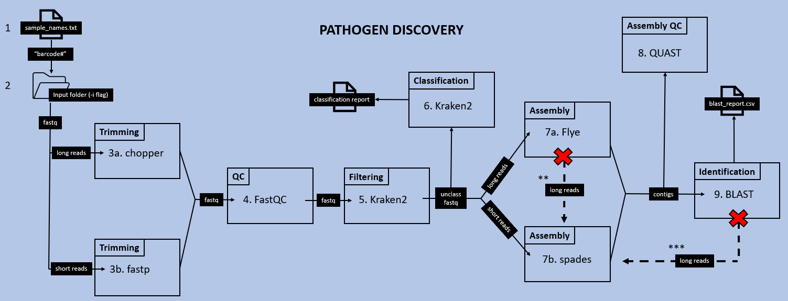
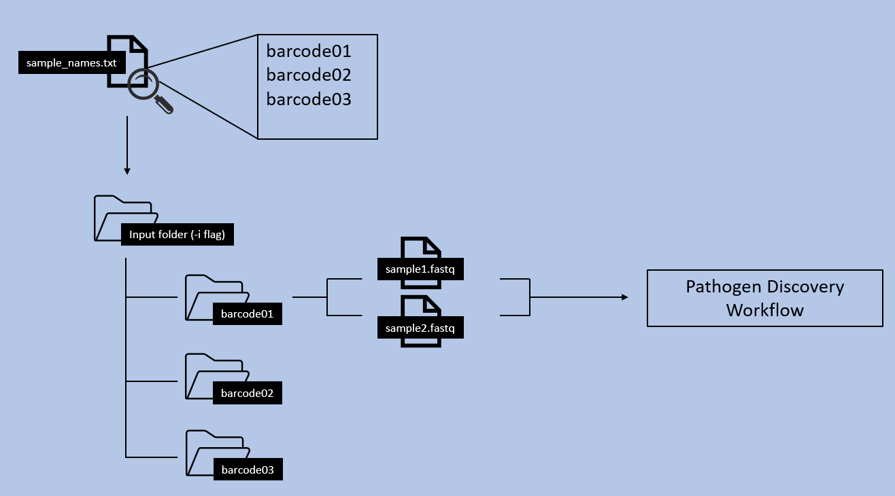

## Pathogen Discovery Workflow Overview



## Summary
This workflow is designed to ingest sequencing reads and identify foreign pathogens. See below for a description of each step:

1. Parse and iterate through sample names from ./data/sample_names.txt

2. Search input directory (-i flag) for directories that have a matching sample name

3. Trimming based on read type:

    a. Trims adapter sequences using [chopper](https://github.com/wdecoster/chopper) for long read data

    b. Trims adapter sequences using [fastp](https://github.com/OpenGene/fastp) for short read data

4. Performs QC on reads with [FastQC](https://github.com/s-andrews/FastQC)

5. Filters out human reads with [kraken2](https://github.com/DerrickWood/kraken2)

6. Generates a classification report of the unclassified, filtered reads from step 5 using [kraken2](https://github.com/DerrickWood/kraken2)

7. Assembly based on read type:

    a. Performs De novo assembly on unclassified reads using [Flye](https://github.com/fenderglass/Flye/tree/flye) for long reads
    
    &nbsp;&nbsp;&nbsp;&nbsp;&nbsp; __**__ If the long read assembler fails to produce any viable contigs, the long reads will be forced through spades as short, unpaired reads. Contigs produced from this brute force method should be thoroughly evaluated for accuracy

    b. Performs De novo assembly on unclassified reads using [spades](https://github.com/ablab/spades) for short reads

8. Uses [quast](https://github.com/ablab/quast) to evaluate and QC assembly contigs

9. Performs a BLAST query on the assembly contigs to identify pathogens and outputs blast result to csv file

    &nbsp;&nbsp;&nbsp;&nbsp;&nbsp; __***__ If BLAST does not find any hits querying long read assembly contigs, then the long reads will be reassembled with spades (as single-end short reads) and run through BLAST again

It can either be submitted to the cluster job scheduler using `-q` (qsub) or you can run the workflow on an interactive node in rosalind without using the `-q` flag

## Installation Instructions
As long as this workflow is running on `rosalind.biotech.cdc.gov`, no other dependencies need to be installed. Just clone the git repo and the pipeline should be ready to go:

```bash
git clone https://git.biotech.cdc.gov/rtq0/pathogen-discovery.git
```

## Input Data and Directory Structures
This workflow was designed with a specific directory structure in mind. The text file, `./data/sample_names.txt`, should be filled out with the names of the directories of interest within the input directory you specify with the `-i` parameter. If a subdirectory of the input directory has a name that is listed in `./data/sample_names.txt`, then the fastqs within that subdirectory will be passed into the workflow for analysis. Any subdirectories that do not have a corrsponding name listed, will be skipped over. The diagram below provides a visual representation of how this process works:



## Usage
To see a full list of options run the following command:
```bash
./bin/run.sh -h
```

Example usage for qsub submission:

```bash
./bin/run.sh -q -e your@email.com -t nanopore -i </path/to/fastq/sample/directories>
```

Example usage for local session/interactvie node:

```bash
./bin/run.sh -t illumina-paired -i </path/to/fastq/sample/directories>
```